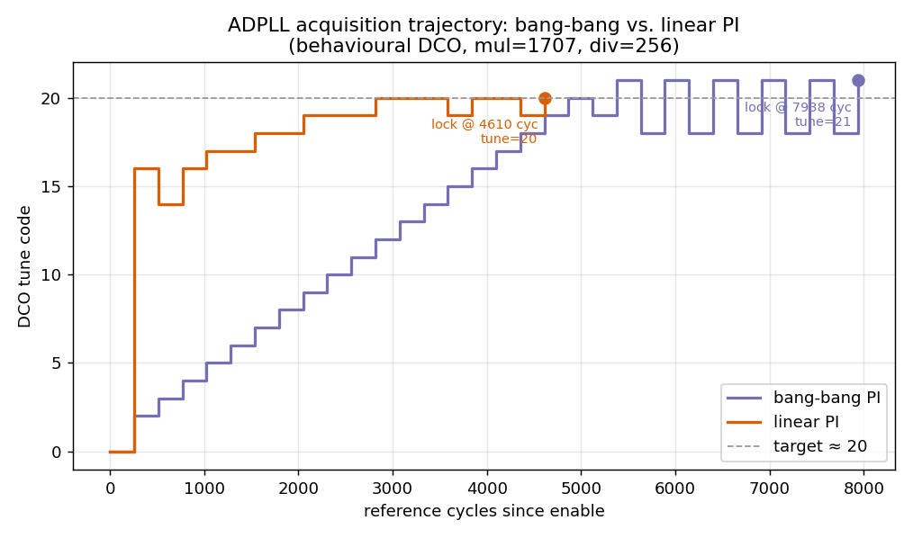
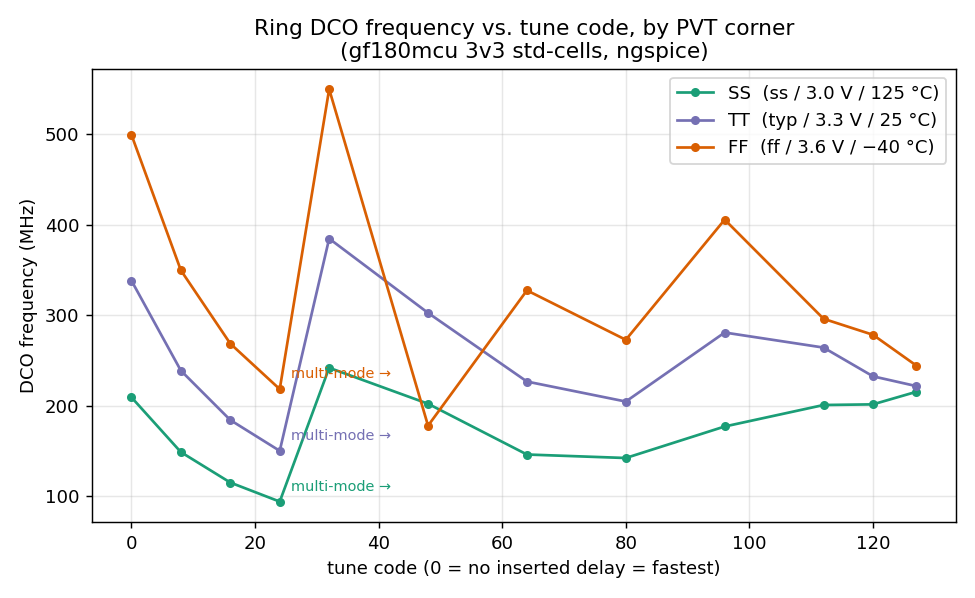
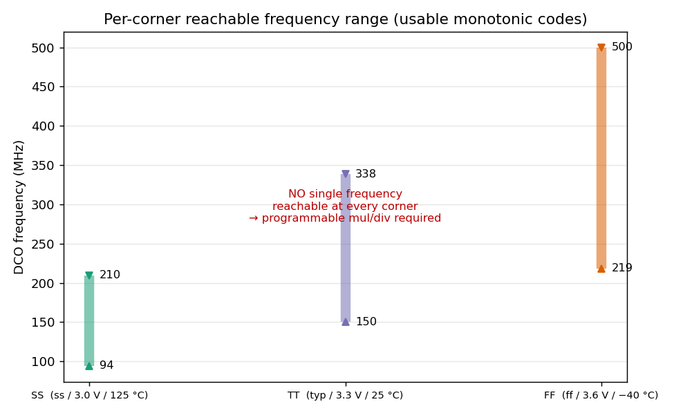

# ADPLL design survey (gf180mcu, all-standard-cell)

A survey of all-digital PLL (ADPLL) building-block variants for the `src/adpll/` subsystem,
grounded in the ADPLL literature cited below. Every block is built **only** from gf180mcu standard cells
(so it goes through the normal digital flow and is SPICE-characterizable like any cell);
genuinely analog blocks (LC tank, MOS varactors, current-DAC bias, stochastic/mismatch TDC)
are intentionally excluded.

## References

- **[Kratyuk2007]** V. Kratyuk, P. K. Hanumolu, U.-K. Moon, K. Mayaram, "A Design Procedure
  for All-Digital Phase-Locked Loops Based on a Charge-Pump Phase-Locked-Loop Analogy,"
  *IEEE TCAS-II*, vol. 54, no. 3, pp. 247–251, Mar. 2007.
- **[Hanumolu2007]** P. K. Hanumolu, G.-Y. Wei, U.-K. Moon, K. Mayaram, "Digitally-Enhanced
  Phase-Locking Circuits," *IEEE CICC*, pp. 361–368, 2007.
- **[Staszewski2006]** R. B. Staszewski, P. T. Balsara, *All-Digital Frequency Synthesizer in
  Deep-Submicron CMOS*, Wiley, 2006.
- **[Razavi]** B. Razavi, *Design of CMOS Phase-Locked Loops* (type-II loop dynamics,
  damping/phase-margin background).
- **[DaDalt2004]** J. Lee, K. S. Kundert, B. Razavi, "Analysis and modeling of bang-bang
  clock and data recovery circuits," *IEEE JSSC*, vol. 39, no. 9, 2004 ([Kratyuk2007] ref [12]).
- **[DaDalt2005]** N. Da Dalt, "A design-oriented study of the nonlinear dynamics of digital
  bang-bang PLLs," *IEEE TCAS-I*, vol. 52, no. 1, pp. 21–31, 2005 (gear shifting).

## Architecture

A programmable-ratio frequency synthesizer, the canonical ADPLL pipeline
([Kratyuk2007] Fig. 2 / [Hanumolu2007] Fig. 4):

```
            +-------------------+   +-----------+   +-----+
  F_clk_i ->| adpll_freq_counter   |-->| loop      |-->| ring|--> clk_o (F_DCO)
            | (edge count over  |   | filter    |   | DCO |--+
            |  div_i cycles)    |   |(adpll_controller_bangbang|   +-----+  |
            +-------------------+   | _*)       |            |
                    ^               +-----------+            |
                    +----------- DCO edges (Gray-CDC) -------+
```

At lock `measured == mul`, so **F_DCO = (mul / div) · F_clk_i**: `mul` is the
feedback-multiply ratio N and `div` is the reference divider M. Both are **runtime inputs**
(set over Ethernet through a CSR) — programmability is itself the stated ADPLL advantage:
[Hanumolu2007 §III] *"since the DPLL's loop dynamics are set by DLF coefficients, loop
characteristics can be easily programmed and are also immune to process, voltage, and
temperature (PVT) variations."* A second-order (type-II) loop suffices: [Kratyuk2007 §IV]
*"In all-digital PLLs, this problem does not exist, and a second-order PLL is sufficient."*

### Reusable blocks (one module per file, no swiss-army `generate if`s)

| module | role |
|---|---|
| `adpll_freq_counter` | Gray-coded DCO-edge counter over a runtime-length measurement window; frequency-to-digital front end. Shared by all controllers. |
| `adpll_lock_detect` | declares lock when the watched control code holds within ±`BandRadius` for `MinSamplesForLock` consecutive samples. Shared. |
| `adpll_tdc` | time-to-digital converter: sub-cycle DCO phase at the reference edge (flash `dlybuff` delay line in synthesis / behavioural `$realtime` model in sim). Used only by the phase-domain controller. |

## DCO variants (interface `enable_i`, `tune_i[NumTuneBits-1:0]`, `clk_o`)

All four are ring oscillators (one NAND gate gives the single inversion; `enable_i` gates
it), built from `nand2`/`inv`/`mux2` cells with `keep`/`dont_touch`. A ring is used over an
LC DCO because LC needs an inductor + MOS varactors ([Staszewski2006] §2.1–2.3) — not
standard cells; the accepted cost is phase noise: ring synthesizers *"are all based on a ring
oscillator structure which inherently features relatively poor phase-noise characteristics"*
[Staszewski2006]. Tuning is by switching **delay elements** (std-cell muxes) rather than the
textbook ring method of steering **bias current** ([Kratyuk2007 §II] *"frequency tuning can be
performed by digitally turning on and off bias current sources"*), which would need an analog
current DAC.

| module | architecture | trade-off |
|---|---|---|
| `ring_dco_binary` | binary-weighted delay select (segment i = 2^i pairs, N muxes) | smallest (N muxes); binary weighting can be non-monotonic at major carries |
| `ring_dco_thermometer` | unit-weighted (thermometer) delay select, 2^N identical stages | monotonic by construction; mismatch can be averaged with DEM [Staszewski2006 §3.5]; costs 2^N cells |
| `ring_dco_muxtap` | variable ring **length** via a 2^N:1 tap mux tree (Kajiwara–Nakagawa style) | re-routes feedback instead of inserting delay; fixed mux-tree delay floor |
| `ring_dco_coarsefine` | two banks: a thermometer **coarse** bank (unit = 2^FineBits pairs) + a thermometer **fine** bank (unit = 1 pair) — Staszewski normalized DCO [Staszewski2006 §5] | wide range + fine resolution from few units; coarse/fine mismatch is the DNL term to watch |

## Controller variants

The first three are **frequency-locked** loops sharing one interface
(`clk_i,rst_ni,enable_i,mul_i,div_i,dco_clk_i → tune_o,lock_o`); they reuse `adpll_freq_counter`
+ `adpll_lock_detect` and differ only in the loop filter. The fourth is a true **phase-locked**
loop with a different front end (a TDC + phase accumulators). All are proportional-integral (PI):
[Kratyuk2007 §IV-C] *"A digital equivalent of an analog loop filter consists of a proportional
path with a gain α and an integral path with a gain β."*

| module | loop / filter | source |
|---|---|---|
| `adpll_controller_bangbang` | FLL, **bang-bang** PI: 1-bit (sign) error, integer gains | [Hanumolu2007 §IV-A] *"A DFF simply detects the sign of the phase error and hence serves as a 1-bit TDC"*; bang-bang dynamics [DaDalt2004] |
| `adpll_controller_linear` | FLL, **linear** PI: multi-bit error, power-of-two α/β shifts, anti-windup | full [Kratyuk2007] procedure; gains quantized to powers of two ([Kratyuk2007 §V] *"α ≈ 2⁻³, β ≈ 2⁻⁷"*) |
| `adpll_controller_gearshift` | FLL, **adaptive-step** bang-bang: step `1<<gear`, downshift a gear on each error-sign reversal | gear shifting [DaDalt2005 §V]; a coarse binary search that auto-refines to a ±1 LSB limit cycle (fast lock, no Kp/Ki tuning) |
| `adpll_controller_phase` | **PLL**, type-II PI on the phase error (reference/variable phase accumulators + `adpll_tdc`); interface uses `fcw_i,tdc_frac_i` instead of `mul_i/div_i` | phase-domain ADPLL [Staszewski2006 §4–5]; type-II PI [Kratyuk2007] — nulls *phase*, not just average frequency |

## Results

### Controller comparison — `make sim-adpll-survey` (behavioural DCO, mul=1707, div=256, target tune≈20)

| controller | settled tune | lock time (ref cycles) | notes |
|---|---|---|---|
| bang-bang PI | 21 | 7938 | no gain matching; clean ±1 LSB limit cycle |
| linear PI | 20 | 4610 | faster + exact, **but** required a tiny proportional gain (`AlphaShift=10`) — a larger α slams tune to a rail and oscillates rail-to-rail on a coarse DCO (huge cold-start error) |
| gear-shift | 20 | 4610 | binary-search acquisition (step halves on each sign reversal); as fast as linear PI with **no** Kp/Ki tuning |

All three FLL controllers pass against all four DCOs — `make sim-adpll-matrix` (3 × 4 = 12 variants,
bang-bang settles tune 21, linear/gearshift tune 20). The phase-domain PLL is measured separately
(`make sim-adpll-phase`, fcw=427=6.667·2⁶, AlphaShift=6/BetaShift=11): it **phase**-locks tune≈21 in
**42 ref-cycles** and holds steady-state tune in [18,22] about the ideal 20.



The acquisition trajectory (above, `-DTRACE`) makes the difference visual: the bang-bang loop
steps ±1 LSB/window — a slow staircase that then hunts in a ±1 LSB limit cycle around the
target — while the linear loop slews proportionally to the error and settles in ~58 % of the
time. Finding: the linear PI is faster and more accurate *once gains are matched to K_DCO*, but
on a coarse DCO it needs that care (small α / integral-dominant acquisition); the bang-bang
needs none and is inherently PVT-robust — which is why bang-bang dominates coarse ADPLLs.

### DCO across PVT corners — `make dco-spice-corners` (ngspice ≥ 42, `ring_dco_binary`, 7-bit)

Fine code sweep (raw data in `figures/corner_*.dat`):

| code | SS (ss/3.0 V/125 °C) | TT (typ/3.3 V/25 °C) | FF (ff/3.6 V/−40 °C) |
|---|---|---|---|
| 0 (fastest)  | 209.5 MHz | 338.5 MHz | 499.6 MHz |
| 8            | 149.0 | 239.0 | 349.8 |
| 16           | 115.3 | 184.4 | 268.8 |
| 24 (slowest usable) | 94.3 | 150.3 | 218.5 |
| 32           | 242.1 ⚠ | 384.8 ⚠ | 549.9 ⚠ |
| 64           | 146.3 ⚠ | 226.9 ⚠ | 327.6 ⚠ |
| 127          | 215.6 ⚠ | 221.9 ⚠ | 244.6 ⚠ |

⚠ = multi-mode (non-monotonic): code ≥ 32 the measured fundamental folds back up.




**Min / max DCO frequency:** global max = **499.6 MHz** (FF, code 0); global min usable =
**94.3 MHz** (SS, code 24). Per corner the usable (monotonic, codes 0–24) band is SS 94–210,
TT 150–338, FF 219–500 MHz.

Findings (confirming the textbook):
1. **~2.4× PVT spread** at a fixed code (e.g. code 0: 209→500 MHz) — Staszewski's "highly
   nonlinear frequency vs. voltage." Open-loop frequency setting is impossible; a closed loop
   with programmable `mul/div` is required.
2. **No single fixed target is reachable at every corner**: the usable bands barely miss
   overlapping — SS tops out at 209.5 MHz (code 0) while FF bottoms at 218.5 MHz (code 24).
   The programmable `mul/div` (chosen per-chip after sensing the corner) is what makes "works
   at all corners" achievable — the loop locks to whatever ratio is reachable at the actual
   silicon corner.
3. **High codes go multi-mode** (code ≥ 32 reads *higher* than code 24, non-monotonic): a long
   ring sustains multiple circulating waves. Usable monotonic range is codes 0–24.

Corner sims are run regularly via `make dco-spice-corners` as the design evolves; the figures
are regenerated with `src/adpll/dco/plot_pll.py`.

### Coarse/fine DCO in SPICE — `gen_ring_dco_spice.py --topology coarsefine`

The two-bank DCO is SPICE-characterizable like the rest. Typical-corner sweep (7-bit,
`--fine-bits 3`):

| code | freq (TT) |
|---|---|
| 0   | 110.5 MHz |
| 32  | 71.6 MHz |
| 64  | 53.0 MHz |

Monotonic, as designed. The absolute frequency is lower than the single-bank rings (binary code 0
= 338 MHz) because **both** bank muxes always sit in the base ring path (15 coarse + 7 fine muxes
even at code 0, vs 7 for binary) — the resolution/range split costs a higher fixed delay floor.
The extraction is slower per code than the single-bank rings (the coarse bank instantiates
2^FineBits inverter pairs per unit), so sweep a few codes rather than the full range.

## On-chip: the 12-PLL array

All 12 FLL macros (3 controllers × 4 DCOs) ship in `chip_core` as `adpll_array`, each wired to
`adpll_array_csr` (AXI4-Lite at `0x2000_0000`): a host programs every PLL independently over
Ethernet (PLL `i` = four words at byte offset `i*0x10`: `CTRL`/`MUL`/`DIV`/`STATUS`) and a global
`OBS_SEL` (`0xC0`) picks which PLL's clock+lock drive the observation mux. The 12 PLLs add **zero
pads** — control rides the existing Ethernet→AXI→CSR path and observability is the per-PLL
`STATUS` (lock+tune); the muxed observation is not pad-routed (analog pads can't carry routed
digital, and the padring is full). `make sim-adpll-array` programs all 12 over the CSR and confirms
each locks (bang-bang 21, linear/gearshift 20) plus the mux tracks the selection.
